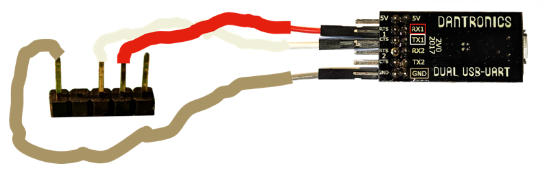

============================================
The more you know, the more you need to know
============================================

.. role:: shell
.. role:: sysname
.. role:: strike
.. raw:: html

  <link rel=stylesheet href=../gen/article.css>
  <meta name=viewport content="width=device-width, initial-scale=1"><!-- FU -->

One lazy, sleepy evening of pointlessly watching television, suddenly the internet connection rudely disappeared.

After a couple of minutes, I dragged my slug-like body over to the ADSL modem and found it just sitting there, looking deceptively normal, with power and ethernet LEDs glowing as brightly as always, but no DSL link and no internet.

I restarted it. It came up as normal, blinking a bit and then sitting green. But no DSL link light arrived.

I tested the phone line. It was still there.

I tried the reset button, even holding it for a whole minute, and nothing happened. I tried the WiFi on/off button, and nothing happened. I tried connecting to the web-based management interface over the network... and, suspiciously... nothing happened. It wasn't even offering DHCP responses.

After a couple of minutes of head-scratching, I decided that despite the green appearance, it was quite likely that the thing was crashing on startup. How could this be? Well, the ethernet lights were giving a false sense of normality. In most devices they are normally connected to a dedicated hardware controller, and data is shuffled in and out by direct memory access, not through the main processor. So, these lights would be merrily enlightened and blinkening even though the main brain had totally stopped.

Obviously, this still made relatively little sense. How could it have spontaneously failed? I was incredibly annoyed, but also incredibly curious. As I currently work from home, it was also going to be a real problem in the morning. Fortunately, this was a very cheap piece of equipment that came for free with my broadband contract. I quickly resolved to give up on it and buy a nearly-equally-cheap replacement from Argos in the morning — which, luckily, freed me to experiment on this one as destructively as necessary, in the name of pointless curiosity.

Cracking the case
=================

This kind of device has come a long way since I last dismantled a broadband router with WiFi. The case contains just one small and tidy PCB. It's clear that this hardware has been produced with great attention to cost effectiveness. But, delightfully, they've still thrown in a free gift!

The manufacturer has spent unnecessary pennies populating a useful header, which looks extremely likely to be the UART connector I was expecting to have to spend ages hunting and testing and soldering for. This is fantastic.

.. sidebar:: What's a |UART|?
  :class: right

  It's a particular type of serial interface which is two separate single-wire one-way links. Signalling happens at a fixed clock rate and is relative to ground, with the voltage level of a "high" normally matching the power rail that a microcontroller or processor's interface is connected to, in this case 3.3v. So, the three pins are ground, transmit (TX) and receive (RX), and often a fourth pin which just offers the same power rail.

Let's identify the pins.

Sticking a multimeter in **resistance mode** (or alternatively, diode mode) with the modem powered off, and placing one probe on a random metal shield that's soldered to the board's ground plane, we test each pin. Pins 2, 3 and 4 give random values, but **pin 1** measures an extremely low resistance — it's the ground pin. They've even helpfully placed it on its own, shouting "I'm the ground pin you were looking for"! Nice.

Sticking the multimeter in **voltage mode**, and keeping one probe on ground, we see that all the other pins measure **3.3v** while the modem is on. This is the power supply and signalling level — conventionally UART pins are held high, and pulled low intermittenly to send a signal.

Testing each pin in turn, though, while powering the modem on, we can see that one pin, **pin 3**, spends a brief time measuring (on average) **1.7v** before rising to **3.3v**. It must be sending some data! So this is the TX pin, and it's about to give us some clues.

At this point, I cut out a section of the case above the pins, leaving IMO a surprisingly elegant connection with the case re-closed and the `Dupont connectors`_ sticking through. Maybe this thing is going to work again, and it might be nice to keep a permanent ability to log in over the serial console when it inevitably turns out to be running Linux. On the other hand, maybe not — I'm still not sure whether this is a software corruption or a deeper, more mysterious hardware flaw — but it doesn't really matter.

.. _`Dupont connectors`: http://tech.mattmillman.com/info/crimpconnectors/#minipv

ABS is a material that gives me a really uncomfortable crunchy sensation, and brings to the imagination scenes of the world 3D-printing itself into dry brittle death. Luckily, it doesn't take very long to chop through this grille.

Seeing what it's saying
=======================

Time to use the serial connection to try and figure out what's going on. UART interfaces are very common and therefore cheaply available as USB devices. The particular one I'm using here was purchased from an independent manufacturer via Tindie_.

.. _Tindie: https://www.tindie.com/products/Dantronics/dual-usb-to-uart-with-handshaking/

Benefits:
~~~~~~~~~

+ Two interfaces in one, which was helpful for my use case at the time of intercepting/repeating two GPS receivers.

+ Hardware flow control pins, which are good as extra general-purpose I/O pins, as well as for their normal purpose of easily getting away with small buffers.

+ Based on \<some other off-the-shelf component\> rather than the usual FTDI clones, avoiding Windows driver issues that... were... over a decade ago. (With Linux, either type just works.)

+ "Arduino compatible" 🙄

Drawbacks:
~~~~~~~~~~

- TX/RX LEDs are software controlled, so you don't necessarily see the presence of signalling unless the computer is already listening.

On a Linux system, :sysname:`udev` detects the USB device being plugged in and creates a virtual file for each interface, which can be used to talk through it — :sysname:`/dev/ttyUSB0` and :sysname:`/dev/ttyUSB1` in the case of this two-in-one device. On Windows, things work completely differently but you get an extra "COM" port. Most Windowsers probably use PuTTY for COMmunication, now that HyperTerminal hasn't been included since the 1990s.

So, time to see what's going on. In the terminal I try :shell:`sudo picocom /dev/ttyUSB1 -b 115200`, then turn on the modem. A wave of unintelligible (but clearly not corrupted) text comes out, and some messages from the bootloader, followed by ":sysname:`Exception`... :sysname:`InvalidOpcode`". Ha! Knew it — software corruption. Time to get some sleep though.

.. sidebar:: Why 115200?
  :class: right

  It's a typical baud rate for a Linux serial console and therefore a decent first guess. There are a variety of less standard options, but :sysname:`115200` is typical for "fast" links. Of course, no UART connection is actually fast by today's standards, but a small/low-power microcontroller would be more likely to use :sysname:`9600`, the other most common speed. (Interestingly, a MIDI cable is also a kind of UART, which runs at :sysname:`31250` baud — totally nonstandard).

  If you didn't remember these arbitrary numbers, looking on the OpenWRT wiki for similar modems from the same manufacturer would reveal :sysname:`115200` as quite likely and worth trying. Some interfaces can also determine the right baud rate automatically, but in the worst case, most software lets you easily step up and down during a session to try different values, until you get readable output.

In the morning I gleefully return to the desk to keep experimenting. My joy evaporates when I turn the modem on again, and this time the exception says something different — ":sysname:`CoProcUnu`". What the hell does that mean? It's not even consistent! It must be some insane and complicated hardware problem, so I have no hope of success even if I can somehow use the serial link to trick the modem into reflashing itself.

On the other hand, the bootloader is clearly working properly up until the point of trying to jump into the ROM, so maybe it's still worth a go. But I have a new consciousness of wasting time. Well, might as well try it. After a quick trial-and-error test to find the RX pin and interrupt the auto-boot sequence, the bootloader turns out to be really helpful and explains to me exactly what it can do. Again, I'm really impressed by this hardware. This is how things should be, really. Past experience with modems from Sky, Virgin etc. led me to expect endless waves of bullshit [#bullshit]_, but luckily `my ISP`_ this time is actually reasonable and seems to have also made a reasonable choice.

.. _`my ISP`: https://www.aa.net.uk/

Let's have a look at a session talking to the bootloader:

.. code:: session

  >>> Hit any key to stop autoboot:002
        [...<spacebar>]
  CFE>

  CFE> help
  >>> Invalid command: "help"
  >>> Available commands: ATMB, ATSH, ATGO, ATSE, ATEN, ATPH, ATBL, ATSR, ATUR, ATHE
  >>> *** command status = -1

  CFE> athe
  >>> Available commands:
  >>>
  >>> ATMB                Use for multiboot.
  >>> ATSH                dump manufacturer related data from NVRAM
  >>> ATGO                Run program from flash image or from host depend on 
  >>>                     [f/h] flag.
  >>> ATSE                show the seed of password generator
  >>> ATEN                set BootExtension Debug Flag
  >>> ATPH                Set/Get PHY`s registers.
  >>> ATBL                Print boot line and board parameter info
  >>> ATSR                System reboot
  !>> ATUR                Upload router firmware to flash from TFTP
  >>> ATHE                print help
  >>>
  >>> For more information about a command, enter 'help command-name'
  >>> *** command status = 0

  CFE> atur
  >>>
  >>>  ATUR [hostip:]filename
  >>>
  >>> *** command status = -2

This is, again, amazing — it really couldn't be much more helpful than this. (As you've made it far enough to appreciate the balance of good and bad I'm reporting, I will now tell you the router I'm working on is `this one`_.) So we now know there's something relatively easy worth trying. We know we can ask it to flash itself over TFTP, and we know it has some sort of concept of having a static IP address, even though it's not completely obvious exactly what it means by this.

.. _`this one`: https://www.zyxel.com/products_services/Wireless-N-VDSL2-4-port-Gateway-with-USB-VMG1312-B10D/

The cheapest, laziest form of purposeful networking
===================================================

What is TFTP? Well, in this case it's the only realistic source of hope for timely success. With only the serial connection, even if the bootloader was happy to receive a file that way, it would take a very long time to re-flash the router's firmware. The .bin file is 28.6MB in size. At our baud rate of 115200bps (*bits* per second), that's 28600000 × 8 ÷ 115200 = 1986 seconds, or **33 minutes**. Some extra time would also have to be sacrificed to transmitting some error correction information, or there would be the risk of waiting all that time, before finally seeing a checksum failure and having to wait again. And that's assuming no other mistakes in the process meanwhile, which — knowing me — would be unlikely. Even after all that, it could still turn out that the modem has some other problem and the time replacing the firmware was wasted.

TFTP is a standard protocol for copying semi-large files over a network, designed to make it really easy to implement a client by using as simple an interaction with the network and server as possible. Due to its simplicity, it's commonly used in situations where you have proper network hardware but don't have conveniences like easy memory allocation or a full TCP implementation — for example, in embedded device bootloaders. If your computer supports network booting, that normally means it's designed to fetch a second-stage bootloader over the network, using TFTP plus some rules about standard file names.

In TFTP a file is divided into fixed-size chunks.

The client asks for chunk 1.

The server sends chunk 1.

The client asks for chunk 2 if it was happy with chunk 1.

The server sends chunk 2.

Both of them are yelling at each other in UDP, which is very easy and normally good enough for a local network. Each chunk can be verified by interleaving checksums with the data, if the ethernet frames' own checks aren't enough, so it can be pretty reliable, maybe with a couple of retries. The client doesn't need to deal with variable length buffers if it doesn't want to; it can just request chunks in order and dump them straight to flash, keeping a running check as it goes. Of course, none of this is good enough for any but the simplest of situations. The server has no way of authenticating clients or restricting access to the files, and the client has no immediate defense against the content being interfered with as it's carried, unless a separate signature check is implemented on the received file.

This is obviously not the most efficient scheme for buffering data, but even so, an ethernet link directly to a computer (even from a cheap modem's controller) should have very low latency and can offer close to 100Mbps bandwidth — which makes this potentially a few hundred times faster than our UART even if we factor in some arbitrary heavy pessimism. In reality, writing the data out to the ROM will probably be the bottleneck instead.

So, in order for this to work, we need a TFTP server on a computer, and need to successfully set up enough of a network for UDP packets to make it from one machine to the other in both directions.

Let's quickly get a TFTP server working.

This example shows how I did it on Arch linux, but as TFTP is very commonly used for network booting, many different servers exist. In this case :sysname:`atftpd` was a completely arbitrary choice because it looked like the smallest and simplest.

The easiest thing to do is just use the normal service configuration and dump the :sysname:`.bin` file you need in the right default place:

.. code:: session

  $ sudo pacman -S atftp
  $ sudo cp ~/download/firmware.bin /srv/atftp/
  $ sudo systemctl start atftpd
  $ systemctl status atftpd
  >>> Active: active (running)

And before introducing more problems at the same time... always best to do a quick local test:

.. code:: session

  $ cd ~/tmp
  $ atftp --get -r firmware.bin 127.0.0.1

That seems to work, so time to use it...

Cable time
==========

Setting up networking without any of the usual automation can be very boring, so choosing a simple approach is key. When the normal startup was interrupted at the serial console, the bootloader suggested it had already chosen a static IP for itself:

.. code:: session

    [...]
  Total Memory: 67108864 bytes (64MB)
  Boot Address: 0xb8000000

  NAND ECC Hamming, page size 0x800 bytes, spare size used 64 bytes
  NAND flash device: ESMT F59L1G81MA, id 0xc8d1 block 128KB size 131072KB
  pmc_init:PMC using DQM mode
  Board IP address                  : 192.168.1.1:ffffff00  
  Host IP address                   : 192.168.1.33  
  Gateway IP address                :   
  Run from flash/host/tftp (f/h/c)  : f  
  Default host run file name        : vmlinux  
  Default host flash file name      : bcm963xx_fs_kernel  
    [...]

I'm not totally sure whether this means it thinks it's :sysname:`192.168.1.1` or :sysname:`192.168.1.33` — but it doesn't matter, it can be either; we'll just give the computer an arbitrary address in the :sysname:`192.168.1/24` subnet and they will probably be happy to talk to each other. Neither has to be "the gateway", as we don't need to get to any other networks.

We connect a cable directly between the volunteer laptop and one of the router's ethernet ports. It has four ports and I didn't choose at random — the one labelled "Port 4 (WAN)" was the one, rather than the other three not labelled "WAN". This one has the ID 0 in software and seemed most likely to work. In half-arsed bootloader mode there are no guarantees — some routers will do TFTP over only one (normally port 0); some will apparently even spam the same packets out of all ports simultaneously to be extra helpful — but this seemed like a sensible choice to try first, and it did turn out to work.

After connecting the cable, what does the laptop say? Well, the link is detected as up but as the bootloader doesn't include a DHCP server, there is no automatically assigned IP address. So, let's set one. (Normally I use :strike:`NetworkMangler` NetworkManager to deal with WiFi networks. When doing manual changes, though, it's normally safer and less annoying to temporarily turn it off.)

.. code:: session

  $ ip link
  >>> 1: lo: <LOOPBACK,UP,LOWER_UP> mtu 65536 qdisc noqueue state UNKNOWN mode DEFAULT group default qlen 1000
  >>>     link/loopback 00:00:00:00:00:00 brd 00:00:00:00:00:00
  >>> 2: enp0s25: <NO-CARRIER,BROADCAST,MULTICAST,UP> mtu 1500 qdisc fq_codel state DOWN mode DEFAULT group default qlen 1000
  >>>     link/ether 68:f7:28:e7:60:5c brd ff:ff:ff:ff:ff:ff

  $ ip addr
  >>> 1: lo: <LOOPBACK,UP,LOWER_UP> mtu 65536 qdisc noqueue state UNKNOWN group default qlen 1000
  >>>     link/loopback 00:00:00:00:00:00 brd 00:00:00:00:00:00
  >>>     inet 127.0.0.1/8 scope host lo
  >>>        valid_lft forever preferred_lft forever
  >>>     inet6 ::1/128 scope host 
  >>>        valid_lft forever preferred_lft forever
  >>> 2: enp0s25: <BROADCAST,MULTICAST,UP,LOWER_UP> mtu 1500 qdisc fq_codel state UP group default qlen 1000
  >>>     link/ether 68:f7:28:e7:60:5c brd ff:ff:ff:ff:ff:ff
  >>>     inet6 fe80::1c1f:23e:2d1e:afa5/64 scope link noprefixroute 
  >>>        valid_lft forever preferred_lft forever

  $ sudo systemctl stop NetworkManager
  $ sudo ip addr add 192.168.1.100 dev enp0s25
  $ ip addr
  >>> 1: lo: <LOOPBACK,UP,LOWER_UP> mtu 65536 qdisc noqueue state UNKNOWN group default qlen 1000
  >>>     link/loopback 00:00:00:00:00:00 brd 00:00:00:00:00:00
  >>>     inet 127.0.0.1/8 scope host lo
  >>>        valid_lft forever preferred_lft forever
  >>>     inet6 ::1/128 scope host 
  >>>        valid_lft forever preferred_lft forever
  >>> 2: enp0s25: <BROADCAST,MULTICAST,UP,LOWER_UP> mtu 1500 qdisc fq_codel state UP group default qlen 1000
  >>>     link/ether 68:f7:28:e7:60:5c brd ff:ff:ff:ff:ff:ff
  !>>     inet 192.168.1.100/32 scope global enp0s25
  !>>        valid_lft forever preferred_lft forever
  >>>     inet6 fe80::1c1f:23e:2d1e:afa5/64 scope link noprefixroute 
  >>>        valid_lft forever preferred_lft forever

Easy! Time to try the download, then.

.. code:: session

  CFE> atur 192.168.1.100:firmware.bin
  >>> Loading 192.168.1.100:firmware.bin ...

        [...10 seconds later...]

  >>> Loading failed.: CFE error -21
  >>> *** command status = -21

Oops. Not working. If we were to use :sysname:`wireshark`, or :sysname:`iptables`' :sysname:`TRACE` target, we'd see packets coming in from the router successfully; but with only its default routing rules, the laptop doesn't know where to send replies. We need to correct that so that they go back out of the correct interface:

.. code:: session

  $ ip route
        [...nothing!]

  $ sudo ip route add 192.168.1.0/24 dev enp0s25
  $ ip route
  >>> 192.168.1.0/24 dev enp0s25 scope link

Let's try again...

.. code:: session

  CFE> atur 192.168.1.100:firmware.bin
  >>> Loading 192.168.1.100:firmware.bin ...

        [...16 seconds later, with lights blinking...]

  >>> Finished loading 28574720 bytes at 0x80770000
  >>> Correct model ID!!!
  >>>
  >>> Flashing root file system at address 0xb8020000 (flash offset 0x00020000).
  >>> kerSysWriteToFlashREW flashAddr[0xb8140000] MaxflashAddr[0xbbc00000] fromaddr[0x80790000] len[28442624]
  >>> kerSysWriteToFlashREW flashAddr[0xb8020000] MaxflashAddr[0x00000000] fromaddr[0x80770000] len[131072]
  >>> Succeed to flash the rootFS.
  >>>
  >>> OK
  >>>
  >>> Resetting board in 0 seconds...HELO
        [...]

And just like that, after a short pause for reconnecting all the cables:

.. code:: session

  >>> Hit any key to stop autoboot:000
  >>> Booting from latest image (address 0xb8020000, flash offset 0x00020000) ...
  >>> Decompression LZMA Image OK!
  >>> Entry at 0x80428e80
  >>> Closing network.
  >>> Disabling Switch ports.
  >>> Flushing Receive Buffers...
  >>> 0 buffers found
  >>> Closing DMA Channels
  >>> Starting program at 0x80428e80
  >>> Linux version 3.4.11 (root@TWPCZT02318-03) (gcc version 4.6.2 (OpenWrt GCC 4.6.2 unknown) ) #1 SMP PREEMPT Wed Jun 26 15:59:35 CST 2019
        [...]

.. image:: leds_after.jpg
   :alt: All LEDs lighting normally, now that it works again

So, all that's left is to clean up on the laptop.

.. code:: session

  $ sudo ip addr flush dev enp0s25
  $ sudo systemctl stop atftpd
  $ sudo systemctl restart NetworkManager

(Did you spot it?: If I'd got the first ``ip address`` command totally right and included a subnet mask, a route would automatically have been added at the same time:)

.. code:: session

                                  vvv
  $ sudo ip addr add 192.168.1.100/24 dev enp0s25
                                  ^^^
  $ ip route
  >>> 192.168.1.0/24 dev enp0s25 proto kernel scope link src 192.168.1.100

Getting the right firmware file
===============================

I didn't even mention this because it's the most boring part of the process — and to be honest, I left it until the last second, because I didn't want to be disappointed by this incredibly lame potential killjoy.

Luckily, the modem's manufacturer was no disappointment at all, operating a simple well-configured FTP server with directories for each model number. For each device they offered downloads of all the manuals, correctly datestamped firmware release ROM files *and* detailed release notes for each one.

So what happened, then?
=======================

- Botched half-successful network intrusion attempt?

- Random Javascript malware half-successfully attacking the management interface from the LAN?

- Accidental interruption of unsafe auto-update process?

- Flash memory corruption from foolishly-placed log files?

I have no clue at all what caused the problem, really. Please write to me if you have a good guess!

Needless conclusion
===================

I have rarely experienced such a strange case of mixed feelings, being simultaneously so annoyed that the problem happened to begin with, but so delighted and impressed with how easy the manufacturer made it to fix.

The thing is, though, if it hadn't been my flat where this thing was installed and failed, and if I hadn't coincidentally learned all the relevant information over the last couple of years, and had the enthusiasm to take it apart and waste time on it, it would just have been sent to landfill. Software, as always, is a dangerous thing to rely on — and increasingly responsible for the early obsolescence of otherwise-reliable hardware (though maybe more so in cases like smartphone updates than situations like this).

On the other hand, the top response to telling this story to most people was disbelief. (In general though, not from people in technical industries.) Do these things happen to me more frequently than others? I can't see why — I hadn't even tried to modify this device or done anything weird at all. Maybe it's a difference in perception? Things don't normally go wrong, so therefore they never do. And when they do, it's just seen as bad luck, not cause and effect that can be studied, so it's easy to write the waste off as part of life and forget about it.

Mostly, I'm just glad the enthusiasm paid off, and one tiny piece of hardware was saved from material downcycling.

.. |UART| raw:: html

   <abbr title="Universal Asynchronous Receiver/Transmitter">UART</abbr>

.. [#bullshit]

  The bullshit I'm talking about here is the typical policy of big "quadplay" providers (who I already dislike due to their long history of buying and ruining formerly-decent ISPs and offering useless multi-buy packages instead) where they will only let you use their specific hardware, and will simultaneously make that hardware as difficult as possible to fix, to obtain replacements for, or to reflash with the manufacturer's proper unrestricted firmware.

  I can only think of two reasons for this — cheaper support through predictable interactions or through remote meddling, or a desire to interfere with customers' LANs in unpleasant ways using their customized spy outposts.

  Neither is a good reason, so whenever I've been living with people who want to use these ISPs, I've tried to construct my own clean, good LAN, with these terrible modems as firewalled-off peripherals on their own subnet that are only used for internet access. I also use encrypted DNS and encrypted protocols as much as possible, on principle.

  There is no need to trust a company with any unnecessary information, particularly if it does not demonstrate moral or sensical integrity. Bear in mind also that, even if it currently does demonstrate these qualities, it could soon be sold to Amazon or Facebook.
